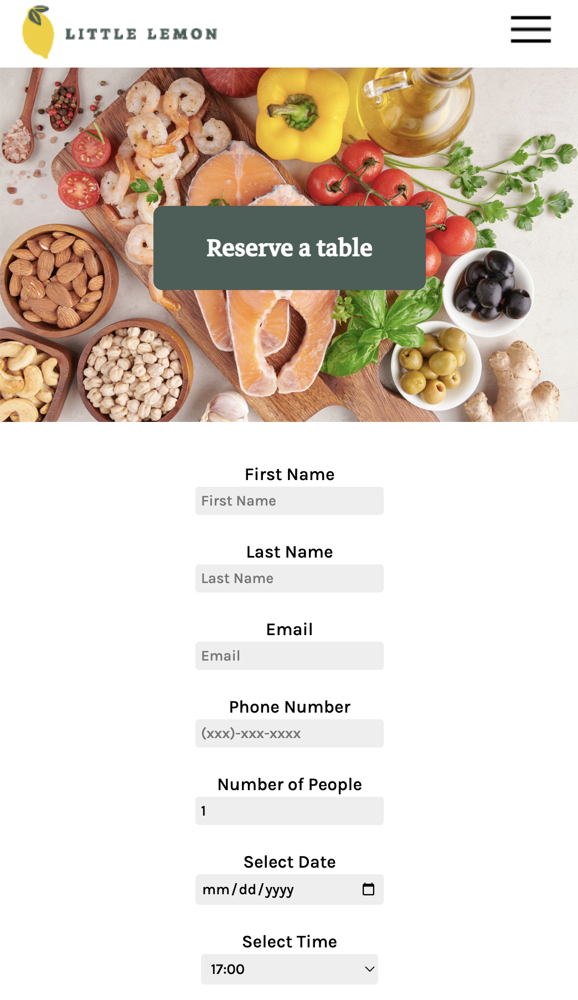

# Little Lemon Peer graded Assignment

A demonstration of what I've learned during my course at Coursera.
This project was created during Meta's Coursera Front-End Development course. This website was the culmuniation of the Front-End Development Track.

This website showcased implementing a booking application on the Little Lemon Website. This was created with React Components to show an understanding of utilizing React for creating the website. This also features utilzing API calls.

Please note: the only functionality working on this website besides the design is the Reserve a Table function.

A dynamic, responsive website querying RESTful Table-booking API & MySQL Database. Features email confirmation and form validation functionality.

### Tech Stack:
##### Front-end:
 - React
 - Axios

##### Back-end:
 - Django, Django-Rest-Framework
 - MySQL (Database)

### Third Party Libraries & APIs:
 - react-router-dom
 - react-responsive-carousel

### Install and Run:
 - Run 'npm start' on the client folder
 - Run the following commands in the server folder:
  - python3 manage.py makemigrations
  - python3 manage.py migrate
  - python3 manage.py runserver
 
Have fun! 
